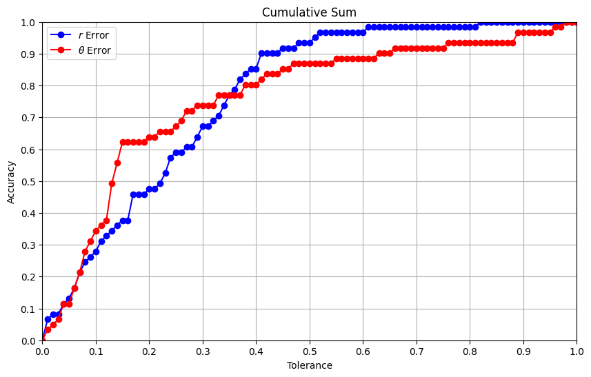
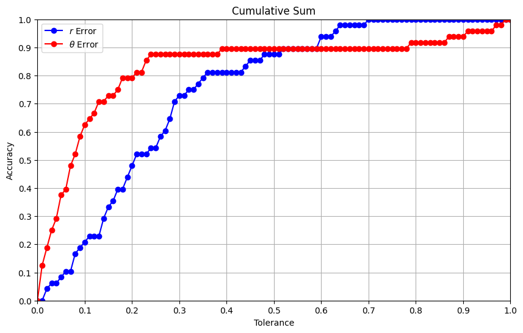

## 🪩 beadfinder

### Usage
- **init.ipynb**: Pre-Calculate the basic features like shape of droplet, size, bounding box, etc.
- **stats.ipynb**: Run the actual bead detection algorithm and also the droplet frequency finding.
- **compare.ipynb**: Generate images of detected bead, reference frame, and a manual vs automatic detection comparison.
- **results.ipynb**: Plot tol vs accuracy sweep

### Results
Set 1 Results

Set 2 Results
